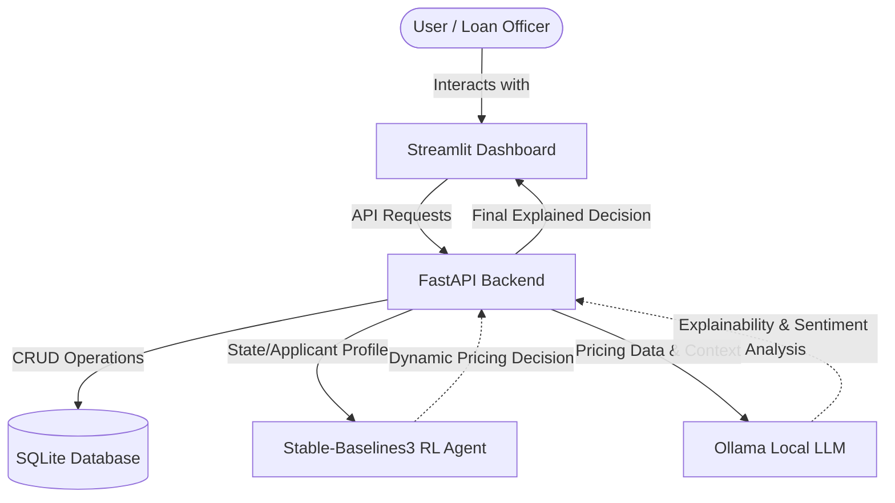

# MIFOS X AI Sentiment Analysis & Dynamic Loan Pricing Module
**C4GT 2026 under MIFOS Initiative**

[](LICENSE)
[](https://www.python.org/downloads/)
[](https://fastapi.tiangolo.com/)
[](https://streamlit.io/)

## Project Title and Description
The **MIFOS X AI Sentiment Analysis & Dynamic Loan Pricing Module** is a next-generation fintech solution designed to automate and explain loan pricing. By leveraging Reinforcement Learning (RL) and Large Language Models (LLMs) running locally via Ollama, this system intelligently adapts interest rates based on dynamic risk assessments and provides transparent, human-readable explanations for its lending decisions.

This module aims to improve financial inclusion and operational efficiency by utilizing alternative data (via sentiment analysis) and advanced optimization strategies (via RL) while adhering to regulatory requirements for explainability (via local LLMs).

## Architecture & Tech Stack

This project utilizes a modern, robust tech stack:

*   **Backend API**: [FastAPI](https://fastapi.tiangolo.com/) - High-performance framework for building APIs with Python.
*   **Frontend Dashboard**: [Streamlit](https://streamlit.io/) - Intuitive and interactive web app for data visualization and interaction.
*   **Database**: [SQLAlchemy](https://www.sqlalchemy.org/) & SQLite - ORM and lightweight database for persistent storage of loan and application data.
*   **AI/RL Models**: [Stable-Baselines3](https://stable-baselines3.readthedocs.io/) & [PyTorch](https://pytorch.org/) - State-of-the-art reinforcement learning algorithms for dynamic pricing optimization.
*   **Explainability & NLP**: [Ollama](https://ollama.com/) (Local LLM) - Ensuring transparency by generating rationale for pricing decisions locally without exposing PII.

### System Flowchart



## Research & Related Work

This module builds upon significant research in the intersection of Artificial Intelligence, Alternative Credit Scoring, and Dynamic Pricing:

1.  **Alternative Credit Scoring via Sentiment Analysis**: Traditional scoring relies heavily on historical financial data, excluding underbanked populations. Research indicates that NLP and sentiment analysis on alternative data sources (transaction notes, customer interaction logs, interview transcripts) can reveal behavioral reliability, acting as a proxy for creditworthiness.
2.  **Reinforcement Learning for Dynamic Pricing**: In fast-changing economic environments, static interest rates lead to inefficiencies. We utilize RL (e.g., Proximal Policy Optimization - PPO) to model loan pricing as a Markov Decision Process (MDP). The agent learns to dynamically adjust interest rates to balance platform liquidity, applicant risk, and expected long-term yield.
3.  **Explainable AI (XAI) in Fintech**: Regulatory compliance (e.g., ECOA in the US) mandates that credit decisions cannot be "black boxes." By integrating local LLMs (like Llama 3 or Gemma 2) via Ollama, we bridge the gap between complex RL outputs and human readability. The LLM translates the high-dimensional state space and RL actions into natural language justifications, ensuring transparency and trust.

## Prerequisites

Before setting up the project, ensure you have the following installed:

*   **Python 3.10+**
*   **Git**
*   **Ollama**: Required for running the local LLM.
    *   Install Ollama from [ollama.com](https://ollama.com/)
    *   Pull the required model (e.g., Llama 3 or Gemma 2:2b):
        ```bash
        ollama pull gemma2:2b
        # or
        ollama pull llama3
        ```
    *   *Note: Ensure the Ollama service is running locally on the default port `11434`.*

## Local Installation & Setup

Follow these steps to set up the project locally.

1.  **Clone the repository:**
    ```bash
    git clone https://github.com/your-org/mifos-x-ai-sentiment-analysis-module.git
    cd mifos-x-ai-sentiment-analysis-module
    ```

2.  **Create and activate a virtual environment:**
    ```bash
    # For Windows
    python -m venv .venv
    .venv\Scripts\activate
    
    # For macOS/Linux
    python3 -m venv .venv
    source .venv/bin/activate
    ```

3.  **Install dependencies:**
    ```bash
    pip install -r requirements.txt
    ```

## Running the Application (Without Docker)

You need to start both the Backend API and the Frontend Dashboard. It is recommended to open two separate terminal windows.

### 1. Start the Backend API
In your first terminal (with the virtual environment activated), run:
```bash
# Set PYTHONPATH to the current directory
export PYTHONPATH=$(pwd) # On Windows PowerShell: $env:PYTHONPATH = (Get-Location).Path

# Run the FastAPI server
python -m uvicorn backend.main:app --host 0.0.0.0 --port 8000 --reload
```
The backend API will be available at `http://localhost:8000`. You can access the interactive Swagger UI at `http://localhost:8000/docs`.

### 2. Start the Frontend Dashboard
In your second terminal (with the virtual environment activated), run:
```bash
# Set PYTHONPATH to the current directory
export PYTHONPATH=$(pwd) # On Windows PowerShell: $env:PYTHONPATH = (Get-Location).Path

# Run the Streamlit app
python -m streamlit run dashboard/app.py --server.port 8501
```
The Streamlit dashboard will be accessible at `http://localhost:8501`.

## Project Structure

```text
mifos-x-ai-sentiment-analysis-module/
├── analytics/             # Analytics scripts and notebooks
├── backend/               # FastAPI Backend API source code
├── chatbot/               # AI chatbot integration files
├── config/                # Configuration settings and env templates
├── dashboard/             # Streamlit Frontend Dashboard application
├── database/              # SQLAlchemy models, SQLite db, and schemas
├── datasets/              # Data for training and evaluation
├── frontend/              # Alternative/additional frontend assets
├── models/                # Trained RL models & PyTorch checkpoints
├── ollama/                # Local LLM configuration & prompt templates
├── reports/               # Generated reports and system logs
├── services/              # Core business logic and external integrations
├── training/              # RL training scripts and pipelines
├── utils/                 # Helper functions and utilities
├── docker-compose.yml     # Docker Compose configuration for containerization
├── Dockerfile             # Docker image definition for the application
├── requirements.txt       # Python dependency list
├── run.ps1                # Windows PowerShell execution script
└── README.md              # Project documentation (this file)
```

## Docker Instructions (Optional)

For a streamlined setup, you can use Docker to spin up the entire stack. This assumes you have Docker and Docker Compose installed.

To build and start the services, simply run:
```bash
docker-compose up --build
```
This command will start the FastAPI backend and Streamlit frontend in containers. *Ensure your local Ollama instance is accessible to the Docker network (usually via `host.docker.internal`).*
